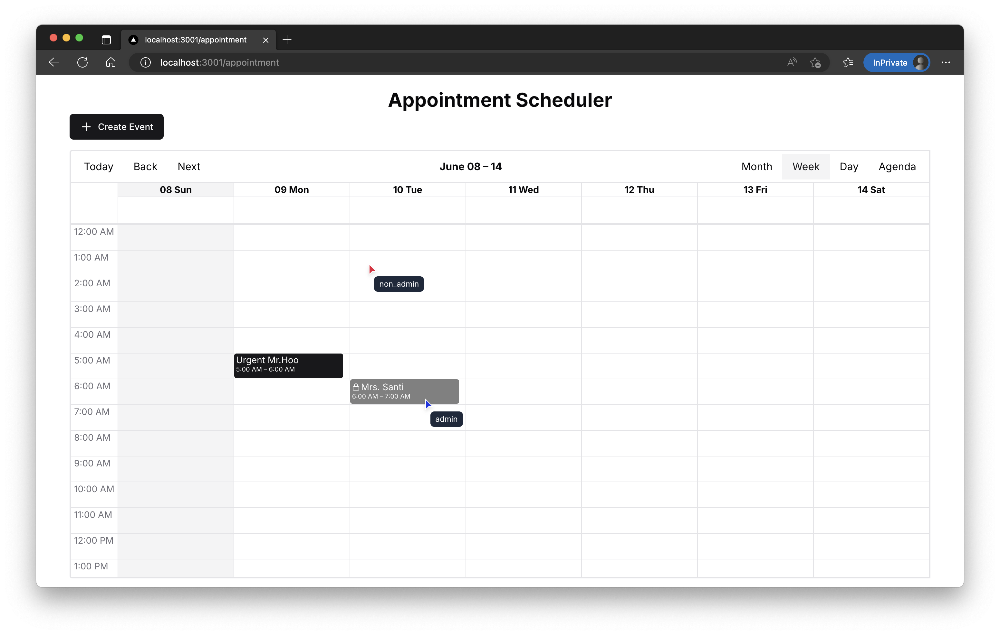

# Appointment Locking System

## The System



This system appointment locking system build with sperate backend and frontend. Backend build with NestJS and Frontend build with ReactJS with NextJS. For running the system locally, you need to run both backend and frontend servers. In below section, I will explain how to run the system locally.

## The Frontend
For Comperhensive frontend documentation, please refer to the https://github.com/didin1453fatih/appointment-locking-system-fe

## The Backend

I used NestJS for the backend framework. Why i choost nestJS compared with expressJS ? Because i need speed up development below one week. ExpressJS minimalist, but this need many of configuration compared with NestJS. With NestJS there are many helper and decoration for speed up pre development config. When I develop app, there are required tools for my perfectionist mindset:

1. Database Migration
2. ORM (Object Relational Mapping)
3. API Documentation
4. Validation Request (DTO)
5. Authentication and Authorization
6. Consistent Error Handling And Response
7. Unit Testing

**When i used expressJS ?** I will be use express if this system is longterm project, internal application with low maintenance, high security. I use express because, I build anything by manual and i will install trusted depedency. It make me understand about depedency and scurity. NestJs is great tool and have many features, but it has many dependency and it is not easy to understand. And versioning increasing faster than expressJS. I will use NestJS if this system is short term project with high maintenance.

## Features

I add capability in this backend for development will be easy and fast. I add feature like:

- **Rest API Documentation**: I use Swagger for API documentation. It will reflect the current state of codebase and provide a user-friendly interface for testing endpoints.
- **Custom CLI Database Migrations**: I use TypeORM for database migrations. It allows you to manage your database schema changes in a structured way. I put at `/scripts/` directory for generate migration based on current models.
- **Database Locking**: I implement a locking mechanism at level database using add unique constrain of `appointmentId` in the `AppointmentLock` table. This ensures that only one user can hold a lock on an appointment at a time, preventing conflicts and ensuring data integrity.
- **Optimistic Locking**: I use optimistic locking with a `version` field in the `Appointment` table. This allows multiple users to read the same appointment data without conflicts, while still preventing overwrites when updates are made. I add this at `acquireLock` and `update` appointment endpoint in file `appointment.service.ts`.
- **Backend Logic Locking**: I implement a locking mechanism at the backend level using a `appointment.service.ts` file. This file contains the logic for handling appointment locks, including acquiring and releasing locks, and managing user requests for control of locks.
- **Locking Unit Tests**: I write comprehensive test cases at `appointment.service.spec.ts` for the locking mechanism to ensure its reliability and correctness. These tests cover various scenarios, including acquiring locks, releasing locks, and handling conflicts.
- **Cron Job**: I implement a cron job to automatically release locks that have expired. If Cron job is not running, it still works because I add a logic in the `appointment.service.ts` if lock is expired, it will automatically release the lock when user try to acquire the lock.
- **Web Socket**: I use Socket.io for broadcast and sending real-time updates to the frontend. This allows the frontend to receive updates about appointment locks and changes in real-time, enhancing user experience. In backend, I implement this at `appointment.gateway.ts` file.
- **Rate Limiting Locking**: I implement rate limiting to prevent abuse of the locking mechanism. This rate limit protect at API `appointment/:id/acquire-lock/:version`.
- **Admin Role Verification**: I implement an admin role verification to ensure that only authorized users can perform certain actions, such as force releasing locks and request control of appointments.
- **DTO Validation**: I use class-validator to validate incoming requests and ensure that the data is in the correct format before processing it. This helps prevent errors and ensures data integrity. Example at `create-appointment.dto.ts`.
- **TypeORM for Sanitize Query**: I use TypeORM to sanitize queries and prevent SQL injection attacks. 


## Realtime appointment data synchronization
1. **Web Socket Connection**: The frontend establishes a WebSocket connection to the backend using Socket.io.
2. **Send Initial Data From Server when Connection Created**: When the WebSocket connection is established, the backend sends the initial appointment data to the frontend.
3. **Listen for Updates**: The frontend listens for updates topics at hook `use-appointment-socket.ts` in Next.js such as:
- `init-appointments`: This topic is used to send the initial appointment data when the WebSocket connection is established.
- `update-appointments`: This topic is used to send the frontend when an appointment is updated.
- `request-control`: This topic is used to notify the owner of the lock when a admin requests control of an appointment lock.
- `request-control-approved`: This topic is used to notify the user who requested control of the lock when their request is approved.
- `force-release-lock-request`: This topic is used to notify the owner of the lock when a admin requests force release of an appointment lock.
- `force-release-lock-approved`: This topic is used to notify the user who requested force release of the lock when their request is approved.
4. **Update UI**: When the frontend receives an update, it updates the UI accordingly, ensuring that the user sees the most current appointment data.


## **Request Control Workflow**:

1. **User Requests Control**: A user requests control of an appointment lock by calling the API endpoint `POST /appointment/:id/request-control`.
2. **Check Only Admin Can Request Control**: The system checks if the user is an admin. If not, it returns an error.
3. **Check Lock Exists**: The system checks if a lock exists for the appointment. If not, it returns an error.
4. **Send To Owner Of Lock**: The system sends a request to the owner of the lock, asking them to release the lock via web socket. This websocket message send to the client with topic `request-control` this placed at file `use-appointment-socket.ts` in NextJS frontend.
5. **Owner Accepts or Rejects**: The owner of the lock can accept or reject the request.
6. **If Accepted**: If the owner accepts the request, it will hit the API endpoint `POST /appointment/:id/approve-request-control` to approve the request. The system will then update the lock to indicate that the user has control.
7. **Send Notification**: The system sends a notification to the user who requested control, indicating that they have been granted control of the lock. It sends a websocket message with topic `request-control-approved` to the client.

## **Force Release Workflow**:

1. **User Requests Force Release**: A user requests a force release of an appointment lock by calling the API endpoint `POST /appointment/:id/force-release-lock-request`.
2. **Check Only Admin Can Request Force Release**: The system checks if the user is an admin. If not, it returns an error.
3. **Check Lock Exists**: The system checks if a lock exists for the appointment. If not, it returns an error.
4. **Send To Owner Of Lock**: The system sends a request to the owner of the lock, asking them to release the lock via web socket. This websocket message send to the client with topic `force-release-lock-request` this placed at file `use-appointment-socket.ts` in NextJS frontend.
5. **Owner Accepts or Rejects**: The owner of the lock can accept or reject the request.
6. **If Accepted**: If the owner accepts the request, it will hit the API endpoint `POST /appointment/:id/force-release-lock-approve` to approve the request. The system will then release the lock.
7. **Send Notification**: The system sends a notification to the user who requested force release, indicating that the lock has been released. It sends a websocket message with topic `force-release-lock-approved` to the client.

## Running the Backend System Locally
### Prerequisites

- Node.js (v20 or higher)
- NestJS CLI
- PostgreSQL (or any other database supported by TypeORM)
- npm

### Steps to Run the Backend

1. **Clone the Repository**:
   ```bash
   git clone https://github.com/your-username/appointment-locking-system.git
   cd appointment-locking-system
   ```
2. **Install Dependencies**:
   ```bash
   npm install
   ```
3. **Copy .env.example to .env**:
   Create a `.env` file in the root directory of the project by copying the example file:
   ```bash
   cp .env.example .env
   ```
4. **Configure Database**: Update the `.env` file with your database connection details.
5. **Run Database Migrations**:
   ```bash
   npm run migration:run
   ```
6. **Start the Application**:
   ```bash
   npm run start:dev
   ```
7. **Access Swagger Documentation**: Open your browser and go to `http://localhost:3000/docs` to access the Swagger documentation for the API.

## Running using docker-compose

This project also support running using docker-compose for simplified setup and running backend.

### Prerequisites

- Docker
- Docker Compose

### Steps to Run Example with Docker Compose

1. **Clone the Repository**:
   ```bash
   git clone https://github.com/your-username/appointment-locking-system.git
   cd appointment-locking-system
   ```
2. **Docker Compose Up**:
   ```bash
   docker-compose up --build
   ```
3. **Access the Application**: Open your browser and go to `http://localhost:3000` for the frontend and `http://localhost:3000/docs` for the backend API documentation.

## Database Documentation

### Appointment

| Column Name   | Data Type     | Nullable | Description                                           |
| ------------- | ------------- | -------- | ----------------------------------------------------- |
| `id`          | UUID (string) | No       | Primary key, automatically generated                  |
| `title`       | varchar       | No       | Title of the appointment                              |
| `patientName` | varchar       | No       | Name of the patient                                   |
| `datebirth`   | date          | No       | Date of birth of the patient                          |
| `gender`      | varchar       | No       | Gender of the patient                                 |
| `phone`       | varchar       | Yes      | Contact phone number                                  |
| `address`     | text          | Yes      | Patient's address                                     |
| `doctorName`  | varchar       | Yes      | Name of the doctor                                    |
| `note`        | varchar       | Yes      | Short notes about the appointment                     |
| `description` | varchar       | Yes      | Longer description of the appointment                 |
| `startTime`   | timestamp     | No       | Start time of the appointment                         |
| `endTime`     | timestamp     | No       | End time of the appointment                           |
| `version`     | integer       | No       | Version number for optimistic locking (defaults to 1) |
| `createdAt`   | timestamp     | No       | Automatically managed timestamp of entity creation    |
| `updatedAt`   | timestamp     | No       | Automatically updated timestamp of last modification  |

### Appointment Lock Table

| Column Name                   | Data Type     | Nullable | Description                                            |
| ----------------------------- | ------------- | -------- | ------------------------------------------------------ |
| `id`                          | UUID (string) | No       | Primary key, automatically generated                   |
| `appointmentId`               | UUID (string) | No       | Foreign key referencing the appointment                |
| `userId`                      | UUID (string) | No       | ID of the user who holds the lock                      |
| `requestControlByUserId`      | UUID (string) | Yes      | ID of the user who requested control of the lock       |
| `requestForceReleaseByUserId` | UUID (string) | Yes      | ID of the user who requested force release of the lock |
| `expiresAt`                   | timestamp     | No       | Expiration time of the lock                            |
| `createdAt`                   | timestamp     | No       | Automatically managed timestamp of entity creation     |

#### Appointment Lock Table Indexes And Unique Constraints

- `id` (primary key): Unique identifier for each lock entry.
- `appointmentId` (foreign key): References the `id` in the Appointment table, linking the lock to a specific appointment. This set to unique to ensure that each appointment can only have one active lock at a time.
- `userId` (foreign key): References the `id` in the User table, indicating which user currently holds the lock.
- `requestControlByUserId` (foreign key): References the `id` in the User table, indicating which user requested control of the lock.
- `requestForceReleaseByUserId` (foreign key): References the `id` in the User table, indicating which user requested force release of the lock.

### User Table

| Column Name | Data Type     | Nullable | Description                                        |
| ----------- | ------------- | -------- | -------------------------------------------------- |
| `id`        | UUID (string) | No       | Primary key, automatically generated               |
| `name`      | varchar       | No       | Name of the user                                   |
| `email`     | varchar       | No       | Email of the user                                  |
| `password`  | varchar       | No       | Password of the user                               |
| `isAdmin`   | boolean       | No       | Indicates if the user is an admin                  |
| `createdAt` | timestamp     | No       | Automatically managed timestamp of entity creation |
